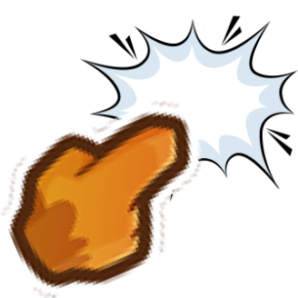

# Click To Pop

  

Click bloons to pop them!

## What it does

- Left-click near any bloon during gameplay to pop it
- Works on all bloon types including MOABs, BFBs and ZOMGs
- Works anywhere on the map
- Pops bloons exactly like a tower hit — shows pop animation, no life loss
- Earn cash per pop
- Fully configurable in Mod Settings

## Settings

| Setting | Default | Description |
|---|---|---|
| Click To Pop Enabled | On | Toggle the mod on/off |
| Click Radius | 140px | How close your click needs to be |
| Cash Per Pop | $1 | Cash earned per bloon popped (0 to disable) |

## How to install

1. Install [MelonLoader](https://github.com/LavaGang/MelonLoader)
2. Install [BTD6 Mod Helper](https://github.com/gurrenm3/BTD-Mod-Helper)
3. Drop `ClickToPop.dll` into your `BloonsTD6/Mods` folder
4. Launch BTD6!

## Author

Made by GluPixel

